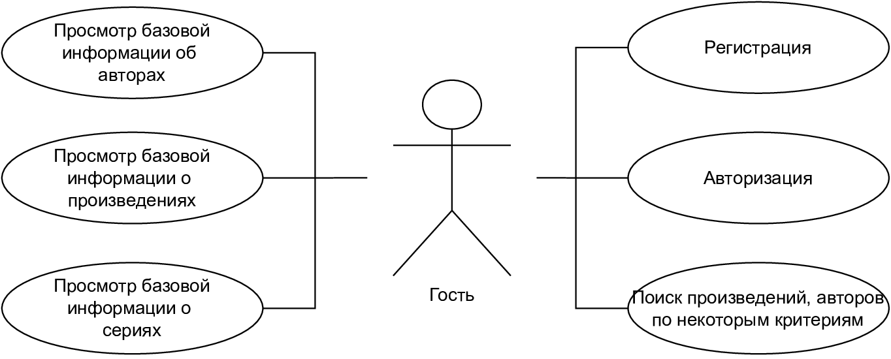
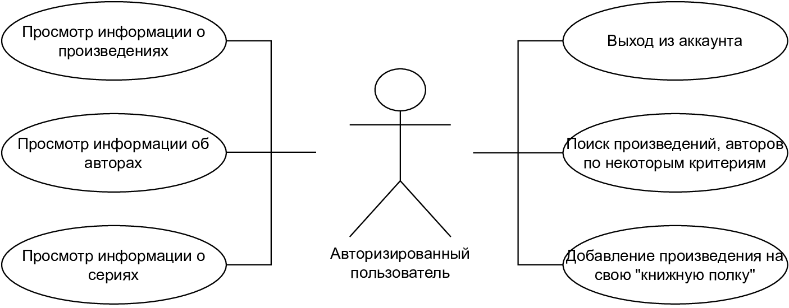
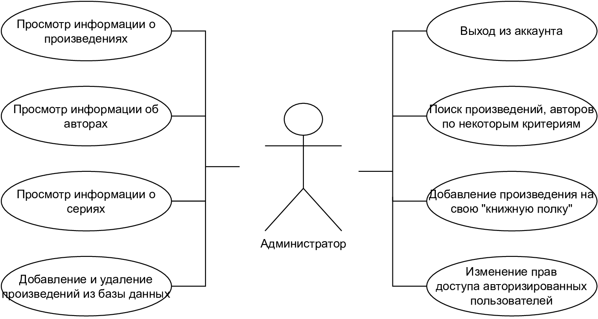
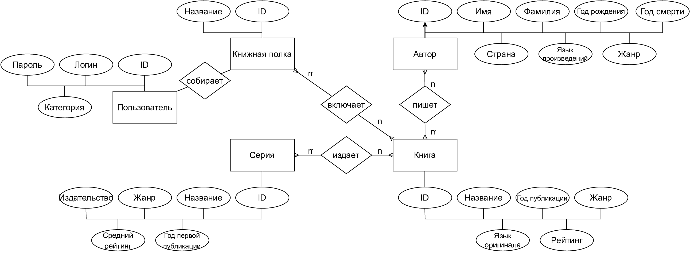
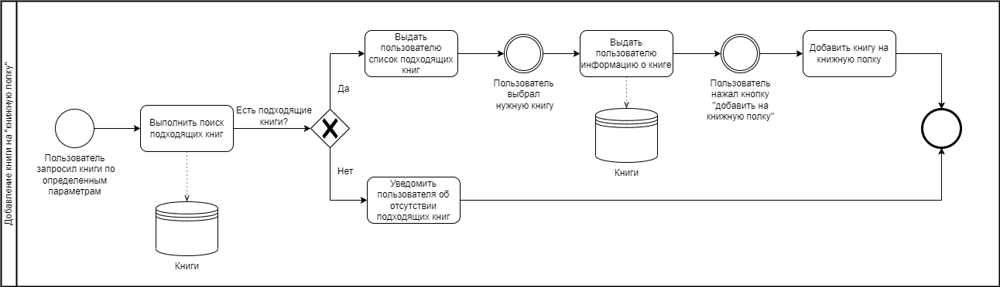
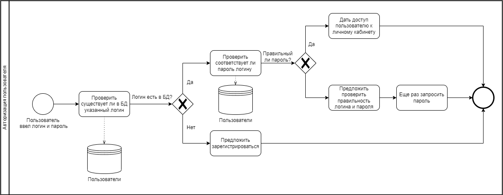

# Информационная система художественной литературы

## Краткое описание

Информационная система художественной литературы, позволяющая искать книги по определенным критериям и добавлять книги к себе на "книжную полку".

## Краткое описание предметной области

Предметная область - поиск художественных книг. Пользователь должен иметь возможность просмотреть все имеющиеся книг данной системы (произвольно или по жанрам/другим критериям) и добавить понравившееся, авторизовавшись на сайте.

## Анализ аналогичных решений

1. Возможность добавления книг на собственную книжную полку
2. Возможность поиска книг по комбинации параметров
3. Предоставление информации о книге по единому шаблону
4. Предоставление информации об авторе
5. Предоставление информации о сериях, в которых выпускается произведение

| Критерий | Zelluloza | Knigopoisk | Fantlab |
|----------|-----------|------------|---------|
| 1        | -         | +          | -       |
| 2        | +         | +          | -       |
| 3        | -         | -          | +       |
| 4        | -         | +          | -       |
| 5        | -         | -          | -       |

## Краткое обоснование целесообразности и актуальности проекта

Данный проект актуален с точки зрения предметной области в силу того, что люди очень часто сталкиваются с проблемой выбора: фильма, книги, какого-то времяпрепровождения. Данная система позволяет облегчить этот самый выбор по причине наличия тех или иных критериев, расширяющих область знаний о произведении. С другой стороны, проект актуален по причине того, что включает большое количество современных технологий, знакомство с которыми является необходимым.

## Use-Case - диаграмма

## ER-диаграмма сущностей

## Пользовательские сценарии (в текстовом виде)

### Сценарий 1

**Описание пользователя**:

Пользователь, ранее не посещавший сайт, заходит на сайт

**Цель пользователя**:

Подобрать произведение для чтения или найти информацию о каком-либо конкретном

**Объекты взаимодействия**:

- Главная секция страницы. На ней располагаются некоторые подборки книг
- Строка поиска. С помощью нее пользователь может найти определенное произведение или произведени конкретного автора
- Фильтры поиска. Пользователь может конкретизировать свой запрос, указав некоторые дополнительные критерии

### Сценарий 2

**Описание пользователя**:

Пользователь использует сайт не в первый раз, желает отложить какое-либо произведение, чтобы прочитать позже

**Цель пользователя**:

Найти книгу и добавить в избранное

**Объекты взаимодействия**:

- Авторизация. Пользователю предоставляется возможность регистрации или авторизации на сайте
- Строка поиска. С помощью нее пользователь может найти определенное произведение или произведени конкретного автора
- Фильтры поиска. Пользователь может конкретизировать свой запрос, указав некоторые дополнительные критерии

### Сценарий 3

**Описание пользователя**:

Зарегистрированный пользователь, ранее посещавший сайт

**Цель пользователя**:

Просмотреть свою "книжную полку"

**Объекты взаимодействия**:

- Авторизация. Здесь пользователь авторизируется под своей учетной записью
- "Книжная полка". Содержит ранее отложенные пользователем книги

### Сценарий 4

**Описание пользователя**:

Пользователь с правами администратора 

**Цель пользователя**:

Изменить содержание базы данных книжной поисковой системы

**Объекты взаимодействия**:

- Авторизация. Здесь пользователь авторизируется под своей учетной записью
- Панель управления. Администратор может изменить права доступа пользователей и управлять книгами, содержащимися в базе данных

### Сценарий 5

**Описание пользователя**:

Пользователь с правами администратора

**Цель пользователя**:

Изменить права доступа пользователей

**Объекты взаимодействия**:

- Авторизация. Здесь пользователь авторизируется под своей учетной записью
- Панель управления. Администратор может изменить права доступа пользователей и управлять книгами, содержащимися в базе данных

## Формализация бизнес-правил (в виде BPMN)

