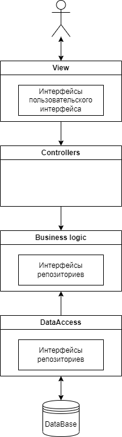

# Информационная система художественной литературы

## Описание типа приложения и выбранного технологического стека

Язык: C# (ASP.NET Core приложение)

Паттерн: MVC

СУБД: Microsoft SQL Server

## Верхнеуровневое разбиение на компоненты

## UML диаграммы классов

