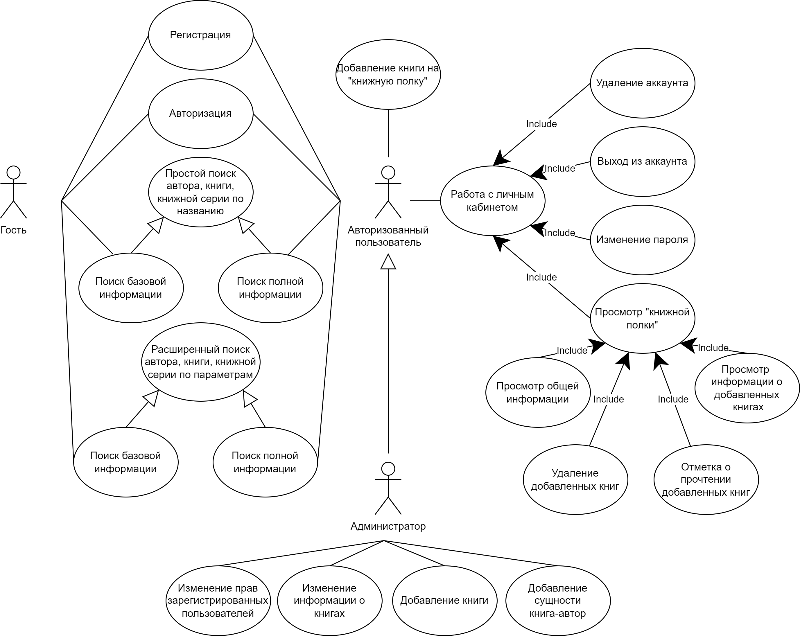

# Книжная поисковая система 

## Цель

Создание книжной поисковой системы, содержащей информацию о книгах, авторах и книжных сериях. 
Разрвбатываемый продукт должен предоставлять возможность взаимодействия с базой данных через Web-приложение.
Должны быть разработаны три сценария взаимодействия с приложением, т.е. три категории пользователя: неавторизованный пользователь, авторизованный пользователь, администратор.

## Функциональные требования

**Гость** может просматривать базовую информацию о произведениях, авторах и книжных сериях, осуществляя простой поиск по названию или расширенный поиск по параметрам (для гостя это параметры, доступные для просмотра), расширенный поиск книг имеет дополнительные параметры: имя автора и книжной серии, которые учитываются, только если введены. 
Для гостя также доступна регистрация и авторизация, которые переводят пользователя в роль авторизованного.

**Авторизованный  пользователь** получает два основных вектора возможностей:  поиск  и  работа  с  личным  кабинетом.
Авторизованный пользователь также может осуществлять простой и расширенный поиск, однако он получает большее количество информации и полей для поиска соответственно. 
На странице расширенного поиска книг авторизованный пользователь может добавить книгу к себе на «книжную полку».
В личном кабинете данный пользователь имеет возможность просмотреть свою «книжную полку», изменить пароль, удалить аккунт. 
На странице «книжной полки» доступна общая информация о количестве книг в избранном и среднем рейтинге этих книг, информация о названии, авторе, рейтинге и состоянии  (прочитанно  или  нет)  всех  добавленных  книгах. 
Кроме  того  есть возможность  отметить  как  прочитанное  отдельную  книгу  или  удалить  её.
Авторизованный пользователь все еще имеет возможность зарегистрироваться или авторизоваться, но в таком случае он будет переключен на пользователя с соответствующим логином.

**Администратор** имеет право на все действия доступные для авторизованного пользователя и дополнительно возможность изменения информации в базе данных: добавление и редактирование книг, а также изменение прав зарегистрированных пользователей (переключение возможно только на авторизованного пользователя или администратора).

## Use-case диаграмма

## BPMN диаграмма

## Пользовательские сценарии

### Сценарий 1

**Описание пользователя**:

Пользователь, ранее не посещавший сайт, заходит на сайт

**Цель пользователя**:

Подобрать произведение для чтения или найти информацию о каком-либо конкретном произведении, авторе, книжной серии

**Объекты взаимодействия**:

- Строка поиска. С помощью нее пользователь может найти определенное произведение, автора или книжную серию по названию
- Фильтры расширенного поиска. С помощью них пользователь может конкретизировать свой запрос, указав дополнительные критерии

### Сценарий 2

**Описание пользователя**:

Пользователь использует сайт не в первый раз, желает отложить какое-либо произведение, чтобы прочитать позже

**Цель пользователя**:

Найти книгу и добавить в избранное

**Объекты взаимодействия**:

- Авторизация. Пользователю предоставляется возможность регистрации или авторизации на сайте
- Строка поиска. С помощью нее пользователь может найти определенное произведение по названию
- Фильтры расширенного поиска. Пользователь может конкретизировать свой запрос, указав дополнительные критерии

### Сценарий 3

**Описание пользователя**:

Зарегистрированный пользователь, ранее посещавший сайт

**Цель пользователя**:

Просмотреть свою "книжную полку"

**Объекты взаимодействия**:

- Авторизация. Здесь пользователь авторизируется под своей учетной записью
- "Книжная полка". Содержит ранее отложенные пользователем книги

### Сценарий 4

**Описание пользователя**:

Пользователь с правами администратора 

**Цель пользователя**:

Изменить содержание базы данных книжной поисковой системы

**Объекты взаимодействия**:

- Авторизация. Здесь пользователь авторизируется под своей учетной записью
- Панель управления. Администратор может изменить права доступа пользователей и управлять книгами, содержащимися в базе данных

## ER-диаграмма сущностей

## Диаграмма БД

## Компонентная диаграмма системы

## Wireframes

**Экран простого поиска:**

**Экран расширенного поиска:**

**Экран результатов поиска:**

**Экран регистрации:**

**Экран избранного пользователя:**

