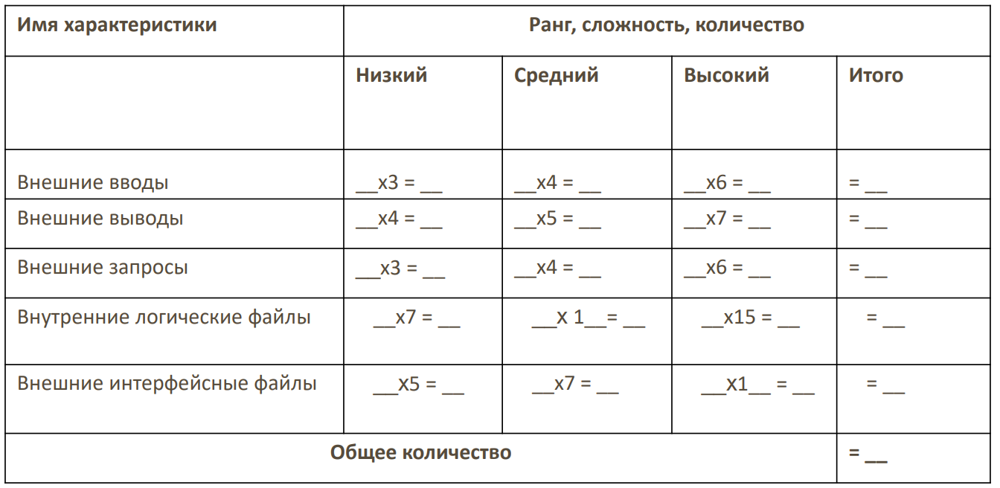

## Освоенный объем

* __Запланированный объем (ЗО)__ — средства, которые были бы затрачены на выполнение задачи в период с начала проекта до выбранной даты отчета, если бы задача точно соответствовала графику и смете.
```
исходные часы * исходные затраты
```

* __Освоенный объем (ОО)__ — средства, которые были бы затрачены на выполнение задачи с самого начала проекта до выбранной даты отчета, если бы фактически выполненная работа оплачивалась согласно изначальной смете.
```
фактические часы * исходные затраты
```

* __Фактические затраты (ФЗ)__ — средства, фактически потраченные на выполнение задачи в период с начала проекта до выбранной даты отчета.
```
фактические часы * фактические затраты
```

* __Отклонение от календарного плана (ОКП)__ — сравнение запланированного и освоенного объема.
```
ОО - ЗО

<0 - проект идет с отставанием, >0 - проект идет с опережением
```

* __Отклонение по стоимости (ОПС)__ — сравнение сметной и фактической стоимости выполненной работы.
```
ОО - ФЗ

<0 - проект не укладывается в смету, >0 - проект укладывается в смету
```

* __Предварительная оценка по завершении (ПОПЗ)__ — ожидаемые общие затраты для задачи, расчет которых основан на предположении, что оставшаяся часть работы будет выполнена в точном соответствии со сметой.

* __Затраты по базовому плану (БПЗ)__ — показывают фиксированные затраты и стоимость ресурсов согласно базовому плану.

* __Отклонение по завершению (ОПЗ)__ — разность между БПЗ и ПОПЗ.
```
<0 - присутствует перерасход средств, >0 - отсутствует перерасход средств
```

#### Пример:

Рассмотрим задачу, для которой согласно базовому плану продолжительность равна 5 дням, объем работ равен 40 часам, а стоимость ресурса выделенного для задачи, составляет 200 рублей в день. Руководитель проекта был вынужден назначить на задачу другой ресурс, со ставкой оплаты 250 рублей в день. К концу третьего дня было выполнено только 20 часов работы. Оцените ситуацию, используя методику освоенного объема.

Один день — 40/5 = 8 часов работы. К концу третьего дня должно быть 24 часа работы.

ЗО = 24 * (200/8) или 3 * 200 = 600 рублей

ОО = 20 * 25 = 500

ФЗ = 20 *  31.25 = 625

ОКП = 500 - 600 = -100 < 0 — проект идет с отставанием

ОПС = 500 - 625 = -125 < 0 — проект не укладывается в смету


## COCOMO №1

__Трудозатраты = С1 * EAF * (Размер)^р1 — количество человеко-месяцев__

* С1 — масштабирующий коэффициент
* EAF — уточняющий фактор, характеризующий предметную область, персонал, среду и инструментарий, используемый для создания рабочих продуктов процесса
* Размер — размер конечного продукта (кода, созданного человеком), измеряемый в исходных инструкциях
* p1 — показатель степени, характеризующий экономию при больших масштабах, присущую тому процессу, который используется для создания конечного продукта; в частности, способность процесса избегать непроизводительных видов деятельности (доработок, бюрократических проволочек, накладных расходов на взаимодействие)

__Время = С2 * (Трудозатраты)^р2 — общее количество месяцев__

* С2 — масштабирующий коэффициент для сроков исполнения
* Р2 — показатель степени, который характеризует инерцию и распараллеливание, присущие управлению разработкой ПО

| Название режима | Размер проекта | Описание | Среда разработки |
|------------------|----------------|----------|------------------|
| Обычный         | До 50 KLOC     | Некрупный проект разрабатывается небольшой командой, для которой нехарактерны нововведения, разработчики знакомы с инструментами и языком программирования | Стабильная |
| Промежуточный   | 50 – 500 KLOC  | Относительно небольшая команда занимается проектом среднего размера, при этом в процессе разработки необходимы определенные инновации | Среда характеризуется незначительной нестабильностью  |
| Встроенный      | Более 500 KLOC | Большая команда разработчиков трудится над крупным проектом, в котором необходим значительный объем инноваций | Среда состоит из множества нестабильных элементов |

__Основные формулы:__

| Вариант        | Трудозатраты               | Время                     |
|----------------|----------------------------|---------------------------|
| Обычный        | 3.2 * ЕАF * (Размер)^1.05  | 2.5 * (Трудозатраты)^0.38 |
| Промежуточный  | 3.0 * ЕАF * (Размер)^1.12  | 2.5 * (Трудозатраты)^0.35 |
| Встроенный     | 2.8 * ЕАF * (Размер)^1.2   | 2.5 * (Трудозатраты)^0.32 |

__EAF__ — произведение всех значений указанных факторов (фактически, произведение всех не номинальных факторов)

| Идентификатор | Уточняющий фактор работ | Диапазон изменения параметра  | Очень низкий | Низкий | Номинальный | Высокий | Очень высокий |
|---------------|-------------------------|-------------------------------|--------------|--------|-------------|---------|-------------|
| RELY          | Требуемая надежность    | 0.75-1.40                     | 0.75         | 0.86   | 1.0         | 1.15    | 1.4           
| DATA          | Размер базы данных      | 0.94-1.16                     |              |0.94    | 1.0         | 1.08    | 1.16         
| CPLX          | Сложность продукта     | 0.70-1.65                      | 0.7          | 0.85   | 1.0         | 1.15    | 1.3           
| TIME          | Ограничение времени выполнения | 1.00-1.66              |              |        |1.0          | 1.11    | 1.50      
| STOR          | Ограничение объема основной памяти | 1.00-1.56          |              |        | 1.0         | 1.06    | 1.21        
| VIRT          | Изменчивость виртуальной машины | 0.87-1.30             |              | 0.87   | 1.0         | 1.15    | 1.30   
| TURN          | Время реакции компьютера | 0.87-1.15                    |              | 0.87   | 1.0         | 1.07    | 1.15    
| ACAP          | Способности аналитика   | 1.46-0.71                     | 1.46         | 1.19   | 1.0         | 0.86    | 0.71          
| AEXP          | Знание приложений       | 1.29-0.82                     | 1.29         | 1.15   | 1.0         | 0.91    | 0.82          
| PCAP          | Способности программиста | 1.42-0.70                    | 1.42         | 1.17   | 1.00        | 0.86    | 0.7           
| VEXP          | Знание виртуальной машины | 1.21-0.90                   | 1.21         | 1.1    | 1.0         | 0.9     |               
| LEXP          | Знание языка программирования | 1.14-0.95               | 1.14         | 1.07   | 1.0         | 0.95    |               
| MODP          | Использование современных методов | 1.24-0.82           | 1.24         | 1.1    | 1.0         | 0.91    | 0.82          
| TOOL          | Использование программных инструментов | 1.24-0.83      | 1.24         | 1.1    | 1.0         | 0.91    | 0.82          
| SCED          | Требуемые сроки разработки | 1.23-1.10                  | 1.23         | 1.08   | 1.0         | 1.04    | 1.1           

__Бюджет = Трудозатраты * Зарплата__

Распределение работ и времени по стадиям жизненного цикла:

| Вид деятельности                      | Трудозатраты (%) | Время (%)  |
|---------------------------------------|------------------|------------|
| Планирование и определение требований | (+8)             | (+36)      |
| Проектирование продукта               | 18               | 36         |
| Детальное проектирование              | 25               | 18         |
| Кодирование и тестирование отдельных модулей | 26        | 18         |
| Интеграция и тестирование             | 31               | 28         |
| Итого                                 | 108              | 136        |

Распределение бюджета по видам работ по созданию ПО:

| Вид деятельности                                  | Бюджет (%) |
|---------------------------------------------------|------------|
| Анализ требований                                 | 4          |
| Проектирование продукта                           | 12         |
| Программирование                                  | 44         |
| Тестирование                                      | 6          |
| Верификация и аттестация                          | 14         |
| Канцелярия проекта                                | 7          |
| Управление конфигурацией и обеспечение качества   | 7          |
| Создание руководств                               | 6          |
| Итого                                             | 100        |


#### Пример:

Рассматривается программный проект промежуточного типа, оцениваемый в 12 тыс. строк кода, организующий функции обработки данных в коммерческой корпоративной сети. Вначале предполагается, что все показатели драйверов затрат имеют номинальное значение. После расчета основных показателей проекта по методике СОСОМО, было принято решение использовать при реализации проекта самые современные методы и программные инструменты, что неизбежно должно привести к необходимости привлечения к выполнению проекта более квалифицированного персонала. При этом затраты на оплату труда возрастут с 80 тыс. до 100 тыс. рублей на один человеко-месяц. Сравните разницу в затратах и ответьте правильным ли было это решение.

* Проект промежуточного типа, поэтому будут использоваться формулы:

	Трудозатраты = 3.0 * ЕАF * (Размер)^1.12	

	Время = 2.5 * (Трудозатраты)^0.35


* 12 тыс. строк кода — 12 KLOC (размер)

__ДО:__ 

Трудозатраты в человеко-месяцах = 3.0 * 1 * (12)^1.12	= 48.51

Время в месяцах = 2.5 * (48.51)^0.35 = 4.24

Затраты в рублях = 48.51 * 80 000 = 3 880 800 

__ПОСЛЕ:__ 

MODP (использование современных методов) — очень высокий = 0.82 

TOOL (использование программных инструментов) — очень высокий = 0.82 

ACAP (способности аналитика) — высокий = 0.86 

PCAP (способности программиста) — высокий = 0.86 

В первом случае указано, что выбираются самые современные методы и инструменты, то есть коэффициент самый высокий. А во втором случае указано только о повышении квалификации, поэтому выбираем на 1 больше, чем было.

EAF = MODP * TOOL * ACAP * PCAP = 0.82  * 0.82 * 0.86 * 0.86 = 0.49

Трудозатраты = 3.0 * 0.49 * (12)^1.12	= 23.77

Время = 2.5 * (23.77)^0.35 = 7.58

Затраты = 23.77 * 100 000 = 2 377 000 


## СOCOMO №2

## Модель композиции приложений

__Трудозатраты = NOP /PROD__

__NOP__ = (Объектные точки) х [(100 - %RUSE) /100] — новые объектные точки

| Вид объекта | Сложность  | Количество объектных точек |
|-------------|------------|----------------------------|
| Форма       | Простая    | 1                          |
|             | Средняя    | 2                          |
|             | Сложная    | 3                          |
| Отчет       | Простая    | 2                          |
|             | Средняя    | 5                          |
|             | Сложная    | 8                          |
| Модуль      | Язык 3-го уровня | 10                   |

__PROD__ — оценка скорости разработки

| Опытность/возможности разработчика  | Зрелость/возможности среды разработки | PROD |
|-------------------------------------|-------------------------------------|------|
| Очень низкая                        | Очень низкая                        | 4    |
| Низкая                              | Низкая                              | 7    |
| Номинальная                         | Номинальная                         | 13   |
| Высокая                             | Высокая                             | 25   |
| Очень высокая                       | Очень высокая                       | 50   |

__Время = 3,0 * (Трудозатраты)^(0.33 + 0.2 * (p-1.01))__, где _p_ рассчитывается способом, который будет описан далее

#### Пример:
Найти трудозатраты и календарное время работы над следующим проектом: приложение формирует 2 формы средней сложности (запросы к базе данных), 3 отчета высокой сложности и имеет 2 программных модуля на языке 3 уровня. Процент повторного использования кода программы – 10%. Над проектом работает программист средней квалификации, однако имеющий опыт работы в данной предметной области.

OP = 2 * 2 (формы средней сложности) + 3 * 8 (отчеты высокой сложности) + 2 * 10 (модули) = 48

NOP = 48 * [(100 - 10) /100] = 43.2

Трудозатраты = 43.2 / 13 (PROD принят за 13, так как программист имеет среднюю квалификацию и среднее знание среды) = 3.32

Время = 3,0 * (3.32)^(0.33 + 0.2 * (1-1.01)) (пока p принят за 1) = 4.45


## Модель ранней разработки архитектуры 

__Трудозатраты = 2,45 * ЕArch * (Размер)^р__

* EArch = PERS * RCPX * RUSE * PDIF * PREX * FCIL * SCED
* Размер — KSLOC (предпочтительно для подсчета KSLOC предварительно подсчитать количество функциональных точек)

__Время = 3,0 * (Трудозатраты)^(0.33 + 0.2 * (p-1.01))__

| | | Сверхнизкий | Очень низкий | Низкий | Номинальный | Высокий | Очень высокий | Сверхвысокий |
|---|-----------------------------|-------------|--------------|--------|-------------|---------|---------------|--------------|
| PERS | Опытность персонала | 2.12  | 1.62  | 1.26  | 1.00   | 0.83    | 0.63  | 0.50  |
| RCPX | Надежность и сложность продукта | 0.49  | 0.60  | 0.83 | 1.00  | 1.33  | 1.91  | 2.72  |
| RUSE | Повторное использование компонентов |  |  | 0.95  | 1.00  | 1.07   | 1.15  | 1.24  |
| PDIF | Сложность платформы                         |          |           | 0.87   | 1.00        | 1.29    | 1.81          | 2.61         |
| PREX | Способности персонала                         | 1.59        | 1.33         | 1.22   | 1.00        | 0.87    | 0.73          | 0.62         |
| FCIL | Возможности среды                          | 1.43        | 1.30         | 1.10   | 1.00        | 0.87    | 0.73          | 0.62         |
| SCED | Сроки                          |         | 1.43         | 1.14   | 1.00        | 1.00    | 1.00          |         |

## Модель этапа постархитектуры 

__Трудозатраты = 2,45 * EApp * (Размер)^р__

* EApp — результат применения семнадцати уточняющих факторов постархитектурных этапов разработки

__Время = 3,0 * (Трудозатраты)^(0.33 + 0.2 * (p-1.01))__

| Идентификатор | Уточняющий фактор работ | Диапазон изменения параметра | Очень низкий | Низкий | Номинальный | Высокий | Очень высокий | Чрезвычайно высокий |
|---------------|-------------------------|-------------------------------|--------------|--------|-------------|---------|---------------|---------------------|
| RELY          | Требуемая надежность    | 0.81 – 1.26 | 0.81 | 0.91 | 1.0 | 1.1  | 1.26 |      |                 
| DATA          | Размер базы данных      | 0.9 – 1.28  |      | 0.9  | 1.0 | 1.14 | 1.28 |      |   
| CPLX          | Сложность продукта      | 0.73 – 1.74 | 0.73 | 0.87 | 1.0 | 1.17 | 1.34 | 1.74 |
| RUSE          | Требуемый уровень повторного использования | 0.98 – 1.34 |   | 0.98 | 1.0 | 1.07 | 1.15 | 1.34 |
| DOCU          | Соответствие документации требованиям жизненного цикла | 0.81 – 1.23 | 0.81         | 0.91   | 1.0         | 1.11    | 1.23          |                     |
| TIME          | Ограничение времени выполнения | 1.0 – 1.63        ||        | 1.0          | 1.11   | 1.29        | 1.63        |
| STOR          | Ограничение объема основной памяти | 1.0 – 1.46     ||        | 1.0          | 1.05   | 1.17        |  1.46       
| PVOL          | Изменчивость платформы  | 0.87 – 1.3                 |    | 0.87         | 1.0    | 1.15        | 1.3     |               |                     |
| ACAP          | Способности аналитика   | 0.71 – 1.42                   | 1.42         | 1.19   | 1.0         | 0.85    | 0.71          |                     |
| AEXP          | Знание приложений       | 0.81 – 1.22                   | 1.22         | 1.1    | 1.0         | 0.88    | 0.81          |                     |
| PCON          | Преемственность персонала | 0.81 – 1.29                  | 1.29         | 1.12   | 1.0         | 0.9     | 0.81          |                     |
| PCAP          | Способности программиста | 0.76 – 1.34                   | 1.34         | 1.15   | 1.0         | 0.88    | 0.76          |                     |
| PEXP          | Опыт работы с платформой | 0.85 – 1.19                   | 1.19         | 1.09   | 1.0         | 0.91    | 0.85          |                     |
| LTEX          | Знание языка программирования и инструментария | 0.84 – 1.2 | 1.2          | 1.09   | 1.0         | 0.91    | 0.84          |                     |
| TOOL          | Использование программных инструментов | 0.78 – 1.17           | 1.17         | 1.09   | 1.0         | 0.9     | 0.78          |                     |
| SITE          | Распределенная разработка | 0.8 – 1.22                     | 1.22         | 1.09   | 1.0         | 0.93    | 0.86          | 0.8                 |
| SCED          | Требуемые сроки разработки | 0.75 – 1.6                     | 0.75         | 0.85   | 1.0         | 1.3     | 1.6           |                     |


## Правило вычисления показателя степени (p) в модели СОСОМО II

__p__ =  сумма 5-ти показателей / 100 +1.01

Новизна проекта __(PREC)__ — отражает предыдущий опыт организации в реализации проектов данного типа. Очень низкийьуровень этого показателя означает отсутствие опыта, наивысший уровень указывает на компетентность организации-разработчика в данной области ПО.

| Характеристика                                    | Рекомендуемое значение |
|---------------------------------------------------|-----------------------|
| Полное отсутствие прецедентов, полностью непредсказуемый проект | 6.2                   |
| Почти полное отсутствие прецедентов, в значительной мере непредсказуемый проект | 4.96                  |
| Наличие некоторого количества прецедентов        | 3.72                  |
| Общее знакомство с проектом                       | 2.48                  |
| Значительное знакомство с проектом                | 1.24                  |
| Полное знакомство с проектом                      | 0                     |


Гибкость процесса разработки __(FLEX)__ — отображает возможность изменения процесса разработки ПО. Очень низкий уровень этого показателя означает, что процесс определен заказчиком заранее, наивысший — заказчик
определил лишь общие задачи без указания конкретной технологии процесса разработки ПО.

| Характеристика                               | Рекомендуемое значение |
|----------------------------------------------|-----------------------|
| Точный, строгий процесс разработки            | 5.07                  |
| Случайные послабления в процессе              | 4.05                  |
| Некоторые послабления в процессе              | 3.04                  |
| Большей частью согласованный процесс         | 2.03                  |
| Некоторое согласование процесса               | 1.01                  |
| Заказчик определил только общие цели         | 0                     |

Разрешение рисков в архитектуре системы __(RESL)__ — отображает степень детализации анализа рисков, основанного на анализе архитектуры системы. Очень низкий уровень данного показателя соответствует поверхностному анализу рисков, наивысший уровень означает, что был проведен тщательный и полный анализ всевозможных рисков.

| Характеристика    | Рекомендуемое значение |
|-------------------|-----------------------|
| Малое (20 %)     | 7                     |
| Некоторое (40 %) | 5.65                  |
| Частое (60 %)    | 4.24                  |
| В целом (75 %)   | 2.83                  |
| Почти полное (90 %) | 1.41               |
| Полное (100 %)    | 0                     |

Сплоченность команды __(TEAM)__ — отображает степень сплоченности команды и их способность работать совместно. Очень низкий уровень этого показателя означает, что взаимоотношения в команде сложные, а наивысший — что команда сплоченная и эффективная в работе, не имеет проблем во взаимоотношениях.

| Характеристика                          | Рекомендуемое значение |
|-----------------------------------------|-----------------------|
| Сильно затрудненное взаимодействие      | 5.48                  |
| Несколько затрудненное взаимодействие  | 4.38                  |
| Некоторая согласованность              | 3.29                  |
| Повышенная согласованность             | 2.19                  |
| Высокая согласованность                | 1.1                   |
| Взаимодействие как в едином целом      | 0                     |

Уровень зрелости процесса разработки __(PMAT)__ — отображает уровень развития процесса создания ПО в организации-разработчике.

| Характеристика | Рекомендуемое значение |
|----------------|-----------------------|
| Уровень 1 СММ  | 7.8                   |
| Уровень 1+ СММ | 6.24                  |
| Уровень 2 СММ  | 4.68                  |
| Уровень 3 СММ  | 3.12                  |
| Уровень 4 СММ  | 1.56                  |
| Уровень 5 СММ  | 0                     |


#### Пример:

Найти трудозатраты и календарное время работы над следующим проектом: приложение формирует 3 формы две средней сложности (запросы к базе данных) и одна простая (справка по программе), 2 отчета средней сложности
и имеет один программный модуль на языке 3 уровня (статистическая обработка данных). Процент повторного использования кода программы 5%. Над проектом работает один программист низкой квалификации,
имеющий небольшой опыт работы в данной предметной области. Вмешательство со стороны заказчика в процесс проектирования слабое. Анализ архитектуры системы был проведен на среднем уровне. Уровень развития процесса разработки средний, ближе к низкому (между 1 и 2). Сложность платформы разработки ниже средней. Автоматическая генерация кода не используется. Провести оценку показателей проекта по методике
СОСОМО 2, используя модели композиции приложения и ранней разработки архитектуры в предположении, что одна объектная точка соответствует 100 строкам программного кода.

__Показатель степени__

Новизна проекта (PREC) — 4.96 (разработчик небольшой опыт имеет)

Гибкость процесса разработки (FLEX) — 4.05 (слабое вмешательство заказчика )

Разрешение рисков в архитектуре системы (RESL) — 4.24 (анализ проведен на среднем уровне)

Сплоченность команды (ТЕАМ) — 0 (один разработчик)

Уровень зрелости процесса разработки (РМАТ) — 6.24 (между 1 и 2)

p = (4.96 + 4.05 + 4.24 + 0 + 6.24) / 100 + 1.01 = 1.2049

__Модель композиции приложений__

OP = (1 * 1 + 2 * 2) + (2 * 5) + (1 * 10) 25

NOP = 25 * [(100 - 5) / 100] = 23.75

Трудозатраты = 23.75 / 7 = 3.39

Время = 3,0 * (3.39)^(0.33 + 0.2 * (1.2049-1.01)) = 4.71

__Модель ранней разработки архитектуры__

Повторное использование компонентов (RUSE) — низкий 0.95

Сложность платформы разработки (PDIF) — низкий 0.87

Возможности персонала (PERS) — низкие 1.26

Опыт персонала (PREX) — низкий 1.22

Остальные — номинальный 1 

ЕArch = 0.95 * 0.87 * 1.26 * 1.22 = 1.27

Трудозатраты = 2,45 * 1.27 * (2.5)^1.2049 (строк кода OP * 100) = 9.37

Время = 3,0 * (9.37)^(0.33 + 0.2 * (1.2049-1.01)) = 6.85

## Метод функциональных точек

Перемещение данных — простые транзакции:

* Внешний ввод (EI) — элементарный процесс, перемещающий данные из внешней среды в приложение.
* Внешний вывод (ЕО) — элементарный процесс, перемещающий данные, вычисленные в приложении, во внешнюю среду и связанный с созданием и/или обработкой выходной информации приложения.
* Внешний запрос (EQ) — элементарный процесс, состоящий из комбинации «запрос/ответ», не связанный с вычислением производных данных или обновлением внутренних логических файлов (базы данных).

Хранение данных:

* Внутренний логический файл (ILF) — выделяемые пользователем логически связанные группы данных или блоки управляющей информации, которые поддерживаются внутри продукта и обслуживаются через внешние вводы.
* Внешний интерфейсный файл (EIF) — выделяемые пользователем логически связанные группы данных или блоки управляющей информации, на которые ссылается продукт, но которые поддерживаются вне продукта.

__RET__ (тип элемента записи) — это распознаваемая пользователем подгруппа элементов данных во внутреннем или внешнем файле или количество различных используемых форматов записей (груюо говоря, это сущность/таюлица в бд).

__DET__ (тип элемента данных) — это уникальное распознаваемое пользователем, нерекурсивное (неповторяющееся) поле данных (а это атрибуты в одной таблице).

Ранг и оценка сложности внешних вводов __(EI)__:


Ранг и оценка сложности внешних выводов __(ЕО)__:


Ранг и оценка сложности внутренних запросов __(EQ)__:


Ранг и оценка сложности внутренних логических файлов __(ILF)__:


Ранг и оценка сложности внешних интерфейсных файлов __(EIF)__:




#### Пример 

Разрабатывается программная система, у которой 2 простых ввода, 2 сложных вывода и 1 сложный внутренний файл. Каким количеством функциональных точек измеряется эта система?

Общее количество  = (2 * 3) + (2 * 7) + (1 * 15 ) = 35

__Выровненные функциональные точки:__ 

FP = Общее количество * (0,65 + 0,01 * ΣFi )

* Fi — 14 коэффициентов регулировки сложности, который  может принимать следующие значения:
	
	0 — нет влияния

	1 — случайное

	2 — небольшое
	
	3 — среднее
	
	4 — важное
	
	5 — основное 

| № | Системный параметр          | Описание                                                                                      |
|---|-----------------------------|-----------------------------------------------------------------------------------------------|
| 1 | Передача данных             | Сколько средств связи требуется для передачи или обмена информацией с приложением или системой? |
| 2 | Распределенная обработка данных | Как обрабатываются распределенные данные и функции обработки?                                    |
| 3 | Производительность          | Нуждается ли пользователь в фиксации времени ответа или производительности?                       |
| 4 | Эксплуатационные ограничения| Насколько сильны эксплуатационные ограничения и каков объем специальных усилий на их преодоление?|
| 5 | Частота транзакций          | Как часто выполняются транзакции (каждый день, каждую неделю, каждый месяц)?                     |
| 6 | Оперативный ввод данных     | Какой процент информации надо вводить в режиме онлайн?                                          |
| 7 | Эффективность работы конечных пользователей | Приложение проектировалось для обеспечения эффективной работы конечного пользователя? |
| 8 | Оперативное обновление      | Как много внутренних файлов обновляется в онлайновой транзакции?                                |
| 9 | Сложность обработки         | Выполняет ли приложение интенсивную логическую или математическую обработку?                    |
|10 | Повторная используемость    | Приложение разрабатывалось для удовлетворения требований одного или многих пользователей?       |
|11 | Легкость инсталляции        | Насколько трудны преобразование и инсталляция приложения?                                        |
|12 | Легкость эксплуатации       | Насколько эффективны и/или автоматизированы процедуры запуска, резервирования и восстановления? |
|13 | Количество возможных установок на различных платформах | Была ли спроектирована, разработана и поддержана возможность инсталляции приложения в разных местах для различных организаций? |
|14 | Простота изменений (гибкость) | Была ли спроектирована, разработана и поддержана в приложении простота изменений?               |

__Передача данных:__

| Значение | Описание                                                                                                    |
|----------|-------------------------------------------------------------------------------------------------------------|
| 0        | Полностью пакетная обработка на локальном ПК                                                                |
| 1        | Пакетная обработка, удаленный ввод данных или удаленная печать                                             |
| 2        | Пакетная обработка, удаленный ввод данных и удаленная печать                                                |
| 3        | Сбор данных в режиме «онлайн» или дистанционная обработка, связанная с пакетным процессом                 |
| 4        | Несколько внешних интерфейсов, один тип коммуникационного протокола                                        |
| 5        | Несколько внешних интерфейсов, несколько типов коммуникационных протоколов                                  |

__Распределенная обработка данных:__

| Значение | Описание                                                                                                    |
|----------|-------------------------------------------------------------------------------------------------------------|
| 0        | Передача данных или процессов между компонентами системы отсутствует                                       |
| 1        | Приложение готовит данные для обработки на ПК конечного пользователя                                        |
| 2        | Данные готовятся для передачи, затем передаются и обрабатываются на другом компоненте системы (не на ПК конечного пользователя) |
| 3        | Распределенная обработка и передача данных в режиме «онлайн» только в одном направлении                    |
| 4        | Распределенная обработка и передача данных в режиме «онлайн» в обоих направлениях                            |
| 5        | Динамическое выполнение процессов в любом подходящем компоненте системы                                    |

__Производительность:__

| Значение | Описание                                                                                                                                                                       |
|----------|--------------------------------------------------------------------------------------------------------------------------------------------------------------------------------|
| 0        | К системе не предъявляется специальных требований, касающихся производительности                                                                                              |
| 1        | Требования к производительности определены, но не требуется никаких специальных действий                                                                                     |
| 2        | Время реакции или пропускная способность являются критическими в пиковые периоды. Не требуется никаких специальных решений относительно использования ресурсов процессора. Обработка может быть завершена в течение следующего рабочего дня |
| 3        | Время реакции или пропускная способность являются критическими в обычное рабочее время. Не требуется никаких специальных решений относительно использования ресурсов процессора. Время обработки ограничено взаимодействующими системами |
| 4        | То же, кроме того, пользовательские требования к производительности достаточно серьезны, чтобы ее необходимо было анализировать на стадии проектирования                     |
| 5        | То же, кроме того, на стадиях проектирования, разработки и (или) реализации для удовлетворения пользовательских требований к производительности используются специальные средства анализа |

__Эксплуатационные ограничения:__

| Значение | Описание                                                                                                                                                                          |
|----------|-----------------------------------------------------------------------------------------------------------------------------------------------------------------------------------|
| 0        | Какие-либо явные или неявные ограничения отсутствуют                                                                                                                             |
| 1        | Эксплуатационные ограничения присутствуют, но не требуют никаких специальных усилий                                                                                             |
| 2        | Должны учитываться некоторые ограничения, связанные с безопасностью или временем реакции                                                                                      |
| 3        | Должны учитываться конкретные требования к процессору со стороны конкретных компонентов приложения                                                                            |
| 4        | Заданные эксплуатационные ограничения требуют специальных ограничений на выполнение приложения в центральном или выделенном процессоре                                      |
| 5        | То же, кроме того, специальные ограничения затрагивают распределенные компоненты системы                                                                                      |

__Частота транзакций:__

| Значение | Описание                                                                                                                                                                       |
|----------|--------------------------------------------------------------------------------------------------------------------------------------------------------------------------------|
| 0        | Пиковых периодов не ожидается                                                                                                                                                |
| 1        | Ожидаются пиковые периоды (ежемесячные, ежеквартальные, ежегодные)                                                                                                          |
| 2        | Ожидаются еженедельные пиковые периоды                                                                                                                                       |
| 3        | Ожидаются ежедневные пиковые периоды                                                                                                                                         |
| 4        | Высокая частота транзакций требует анализа производительности на стадии проектирования                                                                                     |
| 5        | То же, кроме того, на стадиях проектирования, разработки и (или) внедрения необходимо использовать специальные средства анализа производительности                         |

__Оперативный ввод данных:__

| Значение | Описание                                                                                                                                                                   |
|----------|----------------------------------------------------------------------------------------------------------------------------------------------------------------------------|
| 0        | Все транзакции обрабатываются в пакетном режиме                                                                                                                           |
| 1        | От 1% до 7% транзакций требуют интерактивного ввода данных                                                                                                                |
| 2        | От 8% до 15% транзакций требуют интерактивного ввода данных                                                                                                               |
| 3        | От 16% до 23% транзакций требуют интерактивного ввода данных                                                                                                              |
| 4        | От 24% до 30% транзакций требуют интерактивного ввода данных                                                                                                              |
| 5        | Более 30% транзакций требуют интерактивного ввода данных                                                                                                                   |


__Эффективность работы конечных пользователей:__

Эффективность работы конечных пользователей определяется наличием следующих функциональных
возможностей:

- Средства навигации (например, функциональные клавиши, динамически генерируемые меню)
- Меню
- Онлайновые подсказки и документация
- Автоматическое перемещение курсора
- Скроллинг
- Удаленная печать
- Предварительно назначенные функциональные клавиши
- Выбор данных на экране с помощью курсора
- Использование видеоэффектов, цветового выделения, подчеркивания и других индикаторов
- Всплывающие окна
- Минимизация количества экранов, необходимых для выполнения бизнес-функций
- Поддержка двух и более языков

| Значение | Описание                                                                                                                                                         |
|----------|------------------------------------------------------------------------------------------------------------------------------------------------------------------|
| 0        | Ни одной из перечисленных функциональных возможностей                                                                                                           |
| 1        | От одной до трех функциональных возможностей                                                                                                                     |
| 2        | От четырех до пяти функциональных возможностей                                                                                                                   |
| 3        | Шесть или более функциональных возможностей при отсутствии конкретных пользовательских требований к эффективности                                                |
| 4        | То же, кроме того, пользовательские требования к эффективности требуют специальных проектных решений для учета эргономических факторов (например, минимизации нажатий клавиш, максимизации значений по умолчанию, использования шаблонов) |
| 5        | То же, кроме того, пользовательские требования к эффективности требуют применения специальных средств и процессов, демонстрирующих их выполнение              |


__Оперативное обновление:__

| Значение | Описание                                                                                                                                     |
|----------|----------------------------------------------------------------------------------------------------------------------------------------------|
| 0        | Отсутствует                                                                                                                                  |
| 1        | Онлайновое обновление от одного до трех управляющих файлов. Объем обновлений незначителен, восстановление несложно                             |
| 2        | Онлайновое обновление четырех или более управляющих файлов. Объем обновлений незначителен, восстановление несложно                             |
| 3        | Онлайновое обновление основных внутренних логических файлов                                                                                |
| 4        | То же, плюс необходимость специальной защиты от потери данных                                                                               |
| 5        | То же, кроме того, большой объем данных требует учета затрат на процесс восстановления. Требуются автоматизированные процедуры восстановления |
|          | с минимальным вмешательством оператора                                                                                                      |

__Сложность обработки:__

Сложность обработки характеризуется наличием у приложения следующих функциональных возможностей:
- повышенная реакция на внешние воздействия и (или) специальная защита от внешних воздействий
- экстенсивная логическая обработка
- экстенсивная математическая обработка
- обработка большого количества исключительных ситуаций
- поддержка разнородных типов входных/выходных данных

| Значение | Описание                                                      |
|----------|---------------------------------------------------------------|
| 0        | Ни одной из перечисленных функциональных возможностей        |
| 1        | Любая одна из возможностей                                    |
| 2        | Любые две возможности                                         |
| 3        | Любые три возможности                                         |
| 4        | Любые три возможности                                         |
| 5        | Все пять возможностей                                         |


__Повторная используемость:__

| Значение | Описание                                                      |
|----------|---------------------------------------------------------------|
| 0        | Ни одной из перечисленных функциональных возможностей        |
| 1        | Любая одна из возможностей                                    |
| 2        | Любые две возможности                                         |
| 3        | Любые три возможности                                         |
| 4        | Любые три возможности                                         |
| 5        | Все пять возможностей                                         |


__Легкость инсталляции:__

| Значение | Описание                                                                                                       |
|----------|----------------------------------------------------------------------------------------------------------------|
| 0        | К установке не предъявляется никаких специальных требований                                                  |
| 1        | Для установки требуется специальная процедура                                                                 |
| 2        | Заданы пользовательские требования к конвертированию и установке, должны быть обеспечены и проверены         |
|          | соответствующие руководства. Конвертированию не придается важное значение                                      |
| 3        | То же, однако конвертированию придается важное значение                                                         |
| 4        | То же, что и в случае 2, плюс наличие автоматизированных средств конвертирования и установки                   |
| 5        | То же, что и в случае 3, плюс наличие автоматизированных средств конвертирования и установки                   |


__Легкость эксплуатации:__

| Значение | Описание                                                                                                        |
|----------|-----------------------------------------------------------------------------------------------------------------|
| 0        | К эксплуатации не предъявляется никаких специальных требований, за исключением обычных процедур резервного копирования |
| 1        | Наличие процедур запуска, копирования и восстановления с участием оператора                                      |
| 2        | То же, без участия оператора                                                                                   |
| 3        | Минимизируется необходимость в монтировании носителей для резервного копирования                                 |
| 4        | Минимизируется необходимость в средствах подачи и укладки бумаги при печати                                     |
| 5        | Вмешательство оператора требуется только при запуске и завершении работы системы. Обеспечивается автоматическое восстановление работоспособности приложения после сбоев и ошибок |


__Количество возможных установок на различных платформах:__

| Значение | Описание                                                                                                        |
|----------|-----------------------------------------------------------------------------------------------------------------|
| 0        | Приложение рассчитано на установку у одного пользователя                                                        |
| 1        | Приложение рассчитано на много установок для строго стандартной платформы (технические средства + программное обеспечение) |
| 2        | Приложение рассчитано на много установок для платформ с близкими характеристиками                                |
| 3        | Приложение рассчитано на много установок для различных платформ                                                   |
| 4        | То же, что в случаях 1 или 2, плюс наличие документации и планов поддержки всех установленных копий приложения    |
| 5        | То же, что в случае 3, плюс наличие документации и планов поддержки всех установленных копий приложения          |


__Простота изменений (гибкость):__

Гибкость характеризуется наличием у приложения следующих возможностей:
- поддержка простых запросов, например, логики и (или) в применении только к одному внутреннему логическому файлу (ILF) (вес — 1)
- поддержка запросов средней сложности, например, логики и (или) в применении более чем к одному ILF (вес - 2)
- поддержка сложных запросов, например, комбинации логических связок и (или) в применении к одному или более ILF (вес — 3)
- управляющая информация хранится в таблицах, поддерживаемых пользователем в интерактивном режиме, однако эффект от ее изменений проявляется на следующий рабочий день
- то же, но эффект проявляется немедленно (вес — 2)

| Значение | Описание                                    |
|----------|---------------------------------------------|
| 0        | Ни одной из перечисленных функциональных возможностей |
| 1        | Любая одна из возможностей                  |
| 2        | Любые две возможности                       |
| 3        | Любые три возможности                       |
| 4        | Любые три возможности                       |
| 5        | Все пять возможностей                       |


Как пересчитать функциональные точки в код:

| Язык программирования | Количество операторов на один FP |
|-----------------------|---------------------------------|
| Ассемблер             | 320                             |
| С                     | 128                             |
| Кобол                 | 106                             |
| Фортран               | 105                             |
| Паскаль               | 91                              |
| C++                   | 64                              |
| C#                    | 53                              |
| Java                  | 53                              |
| Ada 95                | 49                              |
| Visual Basic          | 32                              |
| Visual C++            | 34                              |
| Delphi 5              | 18                              |
| Perl                  | 21                              |
| Prolog                | 64                              |
| ANSI SQL              | 13                              |
| Lisp                  | 64                              |


